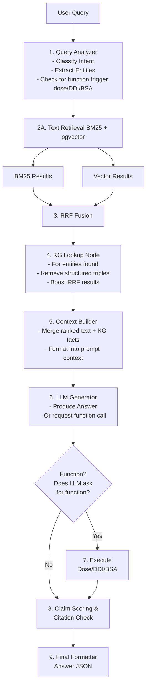

# Medical RAG Architecture (Mermaid)

## Detailed Pipeline Flow



## High-Level Architecture

```mermaid
flowchart TD
    %% User Entry
    User["User Query"] --> Guardrails{"Guardrails / PII Masking"}

    %% Routing Decisions
    Guardrails --> Router{"Query Router"}
    Router -->|Factual / Medical Question| RetrievalPipeline
    Router -->|Dose / DDI / Clinical Tool Use| Tools
    Router -->|Unsafe| Blocked["Refused Response"]

    %% Retrieval Layer
    subgraph RetrievalPipeline[Retrieval Pipeline]
        BM25["BM25 Search - OpenSearch"]
        Embeddings["Semantic Search - pgvector"]
        BM25 --> RRF[RRF Fusion]
        Embeddings --> RRF
    end

    %% Graph & Context Layer
    RRF --> GraphLookup["Knowledge Graph Lookup"]
    GraphLookup --> Context["Context Builder - Chunks + Metadata + Citations"]

    %% LLM Orchestration
    Context --> LLM["Medical LLM - e.g. Meditron, PubMedGPT"]
    Tools --> LLM

    %% Post-Processing
    LLM --> ClaimDecompose["Claim Decomposition"]
    ClaimDecompose --> CitationLinking["Source Attribution - PMID / DOI"]
    CitationLinking --> ContradictionCheck["Contradiction Detection"]
    ContradictionCheck --> FinalAnswer["Cited Answer Returned"]

    %% Return Path
    FinalAnswer --> User
